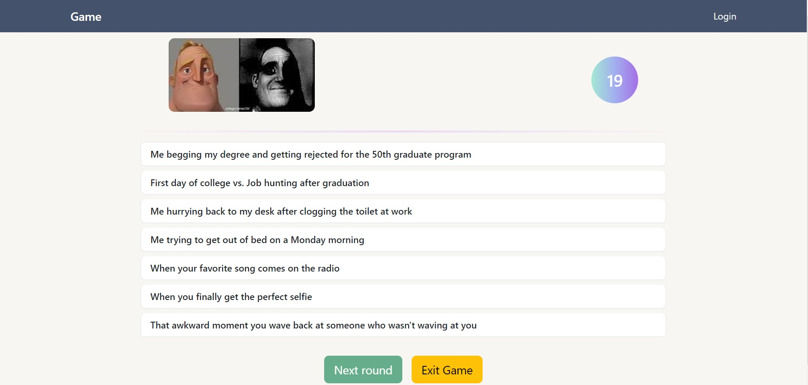
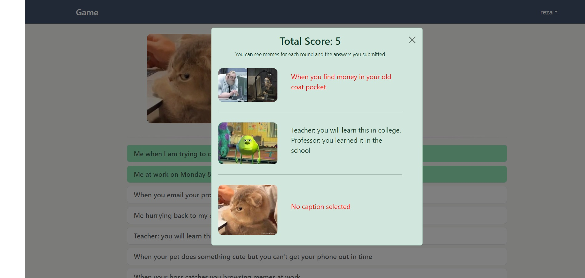

[](https://classroom.github.com/a/AVMm0VzU)

# Exam #1: "Meme game"

## Student: s326447 MOUSAVI SEYED AMIRREZA

## React Client Application Routes

- Route `/`: users acan start a game or even restart the game once they have finished a game
- Route `/login`: users can login or signup at this route
- Route `/profile`: authorized users can see detailed information about their past games

## Main React Components

- `Login` (in `login.jsx`): login component that allows user to log in or sign up if they don't have an account
- `NavBar` (in `navbar.jsx`): navbar component that appears on top of every single page of the website
- `Game` (in `game.jsx`): the component that is responsible for handling games (both for authorized users and unauthorized)
- `Report` (in `report.jsx`): this component is developed for authorized users that show them a summary of the game after third round (the captions they have submitted for each meme in each round)
- `Profile` (in `profile.jsx`): this component is responsible for showing authorized users informations about their past games and their total score of all games

## API Server

### User and authentication routes

## POST `/api/signup`: Create a new user account

- **Purpose**: This endpoint allows a new user to sign up by creating an account.

### Request Parameters and Request Body Content:

- `username` (string): The username of the new user.
- `password` (string): The password for the new user.

### Response Body Content:

- On success:
  ```json
  {
    "status": "successful",
    "message": "Account has been created successfully"
  }
  ```

### Response Status Codes and Possible Errors:

- `201 Created`: Account has been created successfully.
- `400 Bad Request`: Validation error if `username` or `password` is not a string.
- `500 Internal Server Error`: Server error or unhandled exceptions.

---

## POST `/api/login`: Authenticate a user and log them in

- **Purpose**: This endpoint allows a user to log in by providing valid credentials.

### Request Parameters and Request Body Content:

- `username` (string): The username of the user.
- `password` (string): The password for the user.

### Response Body Content:

- On success:
  ```json
  {
    "status": "successful",
    "User": {
      "id": "user_id",
      "username": "user_username"
    }
  }
  ```

### Response Status Codes and Possible Errors:

- `200 OK`: Login successful.
- `400 Bad Request`: Missing credentials.
- `401 Unauthorized`: Incorrect username or password.
- `500 Internal Server Error`: Server error or unhandled exceptions.

---

## POST `/api/logout`: Log out the current user

- **Purpose**: This endpoint allows a logged-in user to log out.

### Request Parameters and Request Body Content:

- No request parameters or body content required.

### Response Body Content:

- On success:
  ```json
  {
    "status": "successful"
  }
  ```

### Response Status Codes and Possible Errors:

- `200 OK`: Logout successful.
- `401 Unauthorized`: If the user is not logged in.
- `500 Internal Server Error`: Server error or unhandled exceptions.

### Game Routes

## POST `/games/meme`: Retrieve a random meme with seven captions (2 correct, 5 incorrect)

- **Purpose**: This endpoint provides a random meme along with seven captions (2 correct and 5 incorrect).

### Request Parameters and Request Body Content:

- `memesUsed` (optional, array): An array of meme IDs that have already been used.

### Response Body Content:

- On success:
  ```json
  {
    "status": "successful",
    "data": {
      "meme": {
        "id": 1,
        "imagePath": "path_to_image"
      },
      "captions": [
        { "id": 1, "text": "Caption 1" },
        { "id": 2, "text": "Caption 2" }
        // more captions
      ]
    }
  }
  ```
- Possible error:
  ```json
  {
    "status": "failed",
    "message": "Meme Finished"
  }
  ```

### Response Status Codes and Possible Errors:

- `200 OK`: Meme and captions retrieved successfully.
- `500 Internal Server Error`: Server error or unhandled exceptions.

---

## GET `games/meme/:memeId/captions`: Retrieve correct captions for a meme

- **Purpose**: This endpoint retrieves the correct captions for a given meme.

### Request Parameters and Request Body Content:

- `memeId` (integer): The ID of the meme.

### Response Body Content:

- On success:
  ```json
  {
    "status": "successful",
    "data": [
      { "id": 1, "text": "Correct Caption 1" },
      { "id": 2, "text": "Correct Caption 2" }
    ]
  }
  ```

### Response Status Codes and Possible Errors:

- `200 OK`: Correct captions retrieved successfully.
- `500 Internal Server Error`: Server error or unhandled exceptions.

---

## POST `games/start`: Start/record a game (logged in users only)

- **Purpose**: This endpoint allows a logged-in user to start a new game.

### Request Parameters and Request Body Content:

- No request parameters or body content required.

### Response Body Content:

- On success:
  ```json
  {
    "status": "successful",
    "gameId": 123
  }
  ```

### Response Status Codes and Possible Errors:

- `201 Created`: Game started successfully.
- `401 Unauthorized`: User is not logged in.
- `500 Internal Server Error`: Server error or unhandled exceptions.

---

## POST `/games/round`: Record details about a round (logged in users only)

- **Purpose**: This endpoint records details about a game round.

### Request Parameters and Request Body Content:

- `gameId` (integer): The ID of the game.
- `memeId` (integer): The ID of the meme.
- `selectedCaptionId` (optional, integer): The ID of the selected caption.

### Response Body Content:

- On success:
  ```json
  {
    "status": "successful",
    "data": {
      "correct": "true",
      "score": 5,
      "message": "Correct caption selected"
    }
  }
  ```
  or
  ```json
  {
    "status": "successful",
    "data": {
      "correct": "false",
      "score": 0,
      "message": "Wrong caption selected"
    }
  }
  ```

### Response Status Codes and Possible Errors:

- `201 Created`: Round details recorded successfully.
- `400 Bad Request`: Validation error if parameters are not integers.
- `401 Unauthorized`: User is not logged in.
- `403 Forbidden`: User is not the owner of the game.
- `409 Conflict : `: The game session has already finished, and new rounds cannot be submitted.
- `500 Internal Server Error`: Server error or unhandled exceptions.

---

## POST `/games/end`: Record total score for a game and finish the game

- **Purpose**: This endpoint records the total score for a game and marks the game as finished.

### Request Parameters and Request Body Content:

- No request parameters or body content required.

### Response Body Content:

- On success:
  ```json
  {
    "status": "successful"
  }
  ```

### Response Status Codes and Possible Errors:

- `200 OK`: Game ended successfully.
- `500 Internal Server Error`: Server error or unhandled exceptions.

---

## GET `/games/`: Retrieve all games or 10 games if the offset is provided (logged in users only)

- **Purpose**: This endpoint retrieves 10 games based on the provided offset. If no offset is provided, it retrieves all games for the current logged-in user.

### Request Parameters and Request Body Content:

- `offset` (optional, integer): The offset for pagination.

### Response Body Content:

- On success:
  ```json
  {
    "status": "successful",
    "data": {
      "total_length": 100,
      "total_score": 500,
      "games": [
        { "id": 1, "score": 50, "created_at": "2023-06-26 12:34:56" }
        // more games
      ]
    }
  }
  ```

### Response Status Codes and Possible Errors:

- `200 OK`: Games retrieved successfully.
- `401 Unauthorized`: User is not logged in.
- `500 Internal Server Error`: Server error or unhandled exceptions.

---

## GET `/games/:gameId/rounds`: Retrieve information about rounds of a single game (logged in users only)

- **Purpose**: This endpoint retrieves information about the rounds of a single game, ensuring the game belongs to the current logged-in user.

### Request Parameters and Request Body Content:

- `gameId` (integer): The ID of the game.

### Response Body Content:

- On success:
  ```json
  {
    "status": "successful",
    "data": [
      {
        "id": 1,
        "imagePath": "path_to_image",
        "text": "Selected caption text",
        "correct": 5
      }
      // more rounds
    ]
  }
  ```

### Response Status Codes and Possible Errors:

- `200 OK`: Rounds retrieved successfully.
- `401 Unauthorized`: User is not logged in.
- `403 Forbidden`: User is not the owner of the game.
- `500 Internal Server Error`: Server error or unhandled exceptions.

## Database Tables

- Table `Users` - contains (username, password, salt, created_at)
- Table `Memes` - contains (id, imagePath)
- Table `Captions` - contains (id, text)
- Table `MemeCaptions` - contains (memeId, captionId)
- Table `MemeCaptions` - contains (memeId, captionId)
- Table `Games` - contains (id, userId, score, created_at)
- Table `Rounds` - contains (id, gameId, memeId, selectedCaptionId, correct, created_at)

## Screenshots


in the scrren shot below the user has logged in and completed three rounds and the summary is shown to the user


## Users Credentials

- `username` : reza, `password` : reza123 (this user has played some games)
- `username` : amir, `password` : amir123 (user has not played a game)
